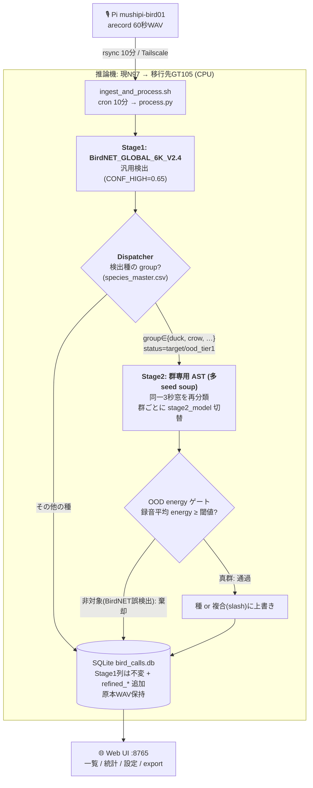

# 全体設計: 2段 野鳥識別パイプライン（BirdNET → 群専用 Stage2 細分類）

最終更新: 2026-06-14 / ステータス: **ルーティングフック実装済(GT105でE2E検証, settings既定disabled)・本番デプロイ未**
／ **群汎用基盤**: duck=運用モデル完成・**crow=Stage2完成+taxonomy登録済(配線のみ未)**・gull=予定。

このドキュメントは BirdProject（運用本体）と bird-fine-classifier（群専用 Stage2 細分類）を横断した
**システム全体設計＝この1本でパイプラインを通せる正典**。Phase 5-E（`future_model_improvements.md`）の
「ステージング(Cascading)」を具現化したもの。当初はカモ類で立ち上げたが、**dispatcher・訓練・推論すべて群汎用**に
組んであり、**新しい分類群（crow / gull …）は「標準作成フロー」（§5.5）に沿ってモデルを作り taxonomy に
登録すれば配線される**。

> **📄 文書の役割分担（迷ったらここ）**
> - **本書（two_stage_pipeline_design.md）＝正典**: 全体像・ランタイム2段・Dispatcher・統合配線・運用規律。「何がどう繋がって動くか」。
> - **`bird-fine-classifier/docs/group_classifier_playbook.md`＝build詳細**: 新群を0から作る判断則＋`build_group.sh` 各段の手順（§5.5 が参照）。
> - **`bird-fine-classifier/docs/architecture.md`＝Stage2内部リファレンス**: AST構造・Energy Gate式・species_master設計・学習設定。
> - **`DESIGN.md`（BirdProject）＝取得基盤**: Pi録音・process.py・DBスキーマ・API（Stage2とは別関心事）。

---

## 1. 目的・背景

- 運用中の BirdNET_GLOBAL_6K_V2.4（汎用6千種 CNN）は、**近縁カモの細分類が不正確**
  （特にカルガモ↔マガモは交雑するほど近縁で**音響的に分離不能**＝Perch本体でも0/30で実証済）。
- 解: **2段化**。BirdNET（汎用検出 Stage1）→ 検出種が登録群（カモ等）なら **群専用 Stage2** で精緻化。
- Stage2 = `bird-fine-classifier`（mushipi-pc で開発）。運用モデルは **多seed soup**、
  KD（Perch蒸留）は弱い生徒・低データで効く**条件付き手法**（duck運用版は最終的に蒸留なしBASE soupが昇格＝§5）。

## 2. システム全体構成



- **群汎用**: Dispatcher / Stage2 / DB は群非依存。duck・crow・gull は同じ経路を `stage2_model` と
  `energy_threshold` だけ替えて通る（§4・§5.5）。図の `{duck, crow, …}` は `species_taxonomy.yaml` に
  登録された群が自動で入る。

## 3. Stage1: BirdNET（現行・実装済）

- モデル: BirdNET_GLOBAL_6K_V2.4（`birdnetlib.Analyzer`）。
- 設定（`process.py`）: `min_conf=CONF_LOW(0.25)`, `sensitivity=1.25`, lat/lon=33.579/130.257（北部九州）。
- 閾値: `CONF_HIGH=0.65` 以上を confirmed として DB 記録。地域フィルタ＋eBirdホワイトリスト。
- 仕分け: detected / review / unknown。
- **役割（2段化後）**: 「カモ類が居る」までの**検出・トリガ**に徹する（種同定は Stage2 に委譲）。

## 4. Dispatcher / ルーティング

- **`species_taxonomy.yaml`**（bird-fine-classifier）: グループ別の推論設定の単一の真実。
  ```yaml
  duck:
    pipeline: { stage2_model, energy_threshold, energy_temperature }
    display_groups: { Mallard: {label: "マガモ/カルガモ", ...} }
  ```
- **`species_master.csv`**: 種 → group / status（target / ood_tier*）。
- ルーティング規約: BirdNET 検出種の group が **stage2_model 設定済の群**（現 `duck`、追加され次第 `crow`/`gull`、
  status=target/ood_tier1）なら、その音声窓を該当群の Stage2 へ。**新群は taxonomy に1行足すだけで有効化**（コード改修不要）。

## 5. Stage2 第1実装: カモ10種分類器（別repo・運用中）

- **運用モデル**: `models/ast-duck-D-base-soup`（多seed BASE soup）。**honest 録音単位 macro-f1 0.897**。
  - 経緯: 旧 `ast-duck-C-kd-soup`(0.871) はリーク込み評価が膨張していた。test拡大＋クリーンsplitで honest 再評価した結果、
    **効いたのはデータ拡大であり蒸留ではない**（天井近いAST最終soupにKDは乗らず, clean では BASE>KD が有意）→ BASE soup を昇格。
- **対象10種**: マガモ/コガモ/オナガガモ/ハシビロガモ/ヒドリガモ/オカヨシガモ/キンクロハジロ/ホシハジロ/ホオジロガモ/ウミアイサ。
- **3秒固定チャンク**: BirdNET の3s窓に整合（運用制約）。
- **OOD energy ゲート**: `predict.py` が録音平均 energy で判定。閾値 **3.081**（D-base-soup で再導出, 真カモ保持0.90）。
  非カモ（BirdNET誤検出）を棄却。対象外カモ類の漏れは複合/分類側で受容。
  ⚠**モデルを替えたら必ず再導出**（energy分布がシフト。旧2.717は新モデルだと非カモFP0.88でゲート無効化）。
- **複合クラス出力（適応的解像度）**: 音響的に割れないペアは複合(slash)で出す。
  - 種（既定）: 分離できる8種。
  - 複合: **マガモ/カルガモ**（カルガモはモデル上Mallardに化ける＝relabelで誠実、最頻種を捨てない）。
  - カモ科 sp.（種不明, 低信頼後退・**未実装**）/ 非カモ（棄却）。

## 5.5 群の追加: 標準作成フロー（duck → crow → gull）

新しい分類群の Stage2 を作る手順は **標準化済み**。duck で確立し crow で再演している。

- **判断則の本体（生きた文書）**: `bird-fine-classifier/docs/group_classifier_playbook.md`
  （9節＋追記ログ。データ収集の薄種対応／grade緩和の是非／評価規律=録音単位CI・リーク厳禁／複合化＝実測してから／OOD動作点）。
- **実行（段階型ドライバ）**: `bird-fine-classifier/scripts/build_group.sh <stage> --config config-<group>.yaml`
  - 8段: `data`(収集) → `prep`(前処理+split) → `embed`(Perch+教師proba) → `train --arm lean|kd`(多seed→soup)
    → `eval`(録音単位CI) → `ood`(閾値) → `confusion`(複合判断) → `register`(taxonomy追記スニペット)。
  - 群固有値は config から導出。**判断点ではドライバは止まって情報を出すだけ**（自動化しない＝上の判断則を守る）。
- **雛形**: `config-template.yaml`（差替箇所を `[TODO]` 化）。
- **配線（本設計との接続）**: 完成した群モデルを `species_taxonomy.yaml` に
  `<group>.pipeline.{stage2_model, energy_threshold, energy_temperature}`（複合あれば `display_groups`）として登録
  → §4 Dispatcher が群汎用なので **process.py 無改修で dispatch 対象入り**（§10 のルーティングフック実装済）。

**各群の状態**:
- **duck** ✅運用モデル完成（`ast-duck-D-base-soup`, OOD 3.081, 複合=マガモ/カルガモ）。BirdProject 統合済（settings既定 disabled）。
- **crow** ✅**Stage2完成+taxonomy登録済（2026-06-14, 配線のみ未）**: 4種（ハシブト/ハシボソ/ミヤマ/カササギ, grade A+B）。
  - 標準フロー(§5.5)を end-to-end 実走＝**2群目の通し実証**。`stage2_model=ast-crow-AB-lean-soup`, `energy_threshold=2.610`。
  - 判断結果: **KD効果ゼロ→lean soup採用**(録音f1≈0.88)／**grade緩和不要**(分離容易)／**複合不要**(音響的に割れる種ペア無し=4種そのまま, カモのカルガモ壁と別物)。
  - OOD: 録音AUROC 在群vs同科Corvidae 0.906、**同属Corvus(ワタリガラス等)でも崩壊せず=crow壁無し**。閾値はXC域暫定→deploy後field再キャリブレ。
  - 残=BirdProject側の配線(§7・duckと同じ settings既定disabledパターン)。
- **gull** ⬜未着手（同フローで展開。OOD収集/監査も群対応済＝config作成→`build_group.sh`を流すだけ）。

## 6. 蒸留と CPU デプロイ（移行の鍵）

- Phase 5-E は「Perchは重くGPU推奨、N97/CPUでは複数モデル並列は厳しい」を**将来ブロッカー**としていた。
- **本設計はこれを蒸留で解消**: Perch（教師, GPU重）→ AST（生徒）へ知識蒸留＋soup。
  **推論時に Perch は不要＝蒸留済み AST 単体で動く**。AST は CPU 推論可（3秒チャンクは軽量）。
- → **N97 / GT105（どちらもCPU）に Stage2 をデプロイ可能**。蒸留は精度向上だけでなく
  「運用機にデプロイ可能にする」価値を持つ。

## 7. 統合（未実装＝本設計の作業）

1. **`process.py` にルーティングフック**: BirdNET 推論後、group==duck の検出に対し該当窓を Stage2 推論。
   - **メモリ・ハンドオフ前提**: Stage1 が**デコード済みの波形(numpy)＋検出の時間オフセット**を保持し、
     Stage2 FE へ**メモリ上でスライス渡し**（ファイル再読込を回避）。CPUベンチの前処理611ms/chunkの
     大半は `librosa.load`（ファイル読込＋48k→16kリサンプル）。再読込を消せば前処理は **~150-250ms** に。
     可能なら **BirdNET が叩いた3秒窓をそのまま再利用**（窓の整合）。残コスト＝リサンプル＋mel（不可避）。
2. **Stage2 のデプロイ**: モデル(`ast-duck-D-base-soup`)＋`predict.py`＋`species_taxonomy.yaml`を推論機へ。
   CPU torch/transformers 環境（GT105 `.venv-cpu` 検証済）。
3. **DBスキーマ（非破壊が必須）**:
   - **Stage1 の元カラム（species/scientific_name/confidence）は絶対不変**。Stage2 結果は**別カラム追加**:
     `refined_species` / `refined_label`(表示=マガモ/カルガモ) / `refined_by` / `refined_confidence` /
     `refined_energy` / **`stage2_model_version`**（モデル更新の追跡）/ `refined_at`。
   - **原本音声(WAV)を保持**: カモ検出セグメントは削除しない（仕分けで消えない運用）。
     理由＝(a) BirdNET自身の混同実証に生の鳴き声が要る (b) モデル改善時の Stage2 再実行
     (c) 人手ラベル監査 (d) ロールバック。

## 8. 移行: N97 → GT105

- 移行先 GT105 は CPU 運用ハブ（Tailscale）。Stage2 が CPU で動くため移行と整合。
- **前提検証（2026-06-12 実測・合格）**: GT105(CPU 16core/30G) で AST KD-soup 推論を計測:
  モデルロード0.8s/RSS452MB、**推論 109ms/chunk(16thread, 8.6ch/s)**、前処理(FE+load)611ms/chunk、ピークRSS1.4GB。
  energyゲート＋複合クラス込みの完全推論を CPU で再現（マガモ→「マガモ/カルガモ」, 非カモ→棄却）。
  運用cadence(10分バッチ・カモは検出の一部=数chunk)に対し**桁違いの余裕**。→ **移行・デプロイは演算面で問題なし**。
  ベンチ: `bird-fine-classifier/tools/bench_cpu_inference.py`（CPU venv `.venv-cpu`）。
- 補足: 前処理(ASTFeatureExtractor)が推論の5倍＝律速。統合時はBirdNETの音声ロードと共有して削れる余地。
- 既存の移管テンプレ: `~/MIGRATION_minipc_to_gt105.md` / `~/.claude/docs/project-ops.md`。

## 9. 評価・運用規律

- **録音単位 macro-f1 ＋ 録音クラスタ bootstrap CI**（`analysis/compare_runs_ci.py`）。
  chunk単位点推定で優劣を断定しない。CI が重なる差(≈±0.05)は「差なし」。
- 弱種の評価解像度（ヒドリ等の小標本）は **test拡大で対応中**（B級worldwide収集→再split→再学習, 進行中）。
- **OOD閾値のフィールド再キャリブレ（重要・デプロイ後必須）**: 現 3.081 は **Xeno-canto域の暫定値**。
  実フィールド（パラボラマイク・固定地点・水辺/風/他鳥/機械音）は energy 分布が異なり、誤りの向き
  （ノイズ→自信↓→真カモ過剰棄却 / 背景音→誤受理）は**現地で測らないと不明**。
  → デプロイ後、**Pi実録音の energy ＋ 人手ラベル(Phase 5-C の correct/wrong)** で `ood_fp_audit.py` の
  録音単位手法を**フィールドデータに当てて再導出**。季節（冬鳥飛来期・水位/風）で変動しうるため
  **固定値でなく監視・調整する tunable** として扱う。Xeno-canto→フィールドのドメインギャップの一断面。

## 10. 未実装・残課題

- [x] **Stage1 カスタムCNN本番化 ＋ 自前季節フィルタ**（2026-06-20, 詳細 `DEVLOG.md` 2026-06-20 / `docs/retrain_candidates.md`）
  - 素6Kは季節無視で冬鳥FPが70%（北部九州5月）。**カスタム分類器使用時は birdnetlib の eBird季節/地域予測が
    構造的に無効**（`classifier_model_path==None` ガード）→ 自前の週次季節フィルタを実装。
  - 九州北部 applicable CNN(165クラス)へ切替＋ `tools/build_seasonal_occurrence.py`(eBirdメタ→週×種)＋
    `data/seasonal_overrides.csv`(人手キュレーション層)＋ **dispatch を sci 駆動化**（英名表記揺れ非依存）。
  - 実フィールド A/B: 冬鳥/別地域FP **36→0**・留鳥非劣化 → 本番切替。ロールバック= `settings.birdnet_model_path=null`。
  - 残: ①override の公的データ裏取り(eBird bar-chart/環境省) ②165クラス欠落種の再学習(ホトトギス等→`retrain_candidates.md`)
    ③難録音をゴイサギに寄せる癖の監視 ④**検出粒度をイベント単位へ**(現「種×ファイル」→「セグメント→種」, go-live前が好機)。
- [x] **GT105 CPU 推論テスト**（2026-06-12 合格: 109ms/chunk・energyゲート/複合クラス CPU 再現・cadence余裕）
- [x] **process.py ルーティングフック**（2026-06-13 実装・GT105でE2E検証, commit 553ae1b）
  - **group 汎用 dispatcher**: `species_taxonomy.yaml` で stage2_model 設定済の群(現 duck/将来 crow/gull)を
    `species_master` の status(target/ood_tier1)で {種→群} に解決。新群は taxonomy に stage2_model を埋めれば自動有効化。
  - **subprocess 隔離**: BirdProject(birdnetlib/TF)から bird-fine `predict.py --json` を別venv(.venv-cpu)で実行＝依存衝突回避。
  - **DB非破壊**: `refined_*`列(species/label/sci/confidence/energy/status/stage2_model_version/group/at)を ALTER 追加、
    Stage1列(species/confidence)不変。`db.set_refined()`。原本WAVは既存の detected/ への move で保持済。
  - 既定 `settings.stage2.enabled=false`＝完全 no-op。新規 `stage2_refine.py`。検証: マガモ→複合通過/非カモ→OOD棄却/crow自動除外。
- [ ] **Stage2 デプロイ**（N97 本番 or N97→GT105 移行）: enabled 化＋両 repo＋モデル(D-base-soup)配布＋cron 確認 ← 次の本命
- [x] **crow 群の end-to-end 実証**（標準フロー§5.5）2026-06-14完了: KD差なし→lean soup／grade緩和不要／複合不要／
      OOD energy閾値2.610(crow壁無し)→`crow.pipeline`登録＋predict検証。**「群追加フローは再現可能」確定**（OOD収集/監査も多群化済）。
      残=BirdProject側の配線(本§10の「Stage2デプロイ」でcrowもenabled対象に)／Skill化（知識=playbook＋実行=build_group.sh）。
- [ ] **【構造リファクタ】Stage2 推論ランタイムの帰属見直し**（crow 一段落後）: 現状 `predict.py`＋`species_taxonomy.yaml`
      ＋`.venv-cpu` が研究repo(bird-fine-classifier)に同居し、**運用システム1つの稼働に 2チェックアウト・2venv・subprocess越境**を要する
      ＝運用面の二重化。問題の継ぎ目は「研究 vs 運用」でなく、**運用コンポーネント(#2)が研究repoに越境**していること。
  - **関心事3分割**: ①Stage2 訓練/研究（bird-fine-classifier に純化＝モデル生産工場）／②Stage2 推論ランタイム（運用=BirdProject へ移送）／
    ③契約 = taxonomy・species_master（研究が産み運用が食う共有）。
  - **移送可能性 確認済**: `predict.py` は内部 `bird_fine.*` モジュール非依存の自己完結（13KB, 依存=torch/transformers/librosa/pandas/yaml のみ）。
    → BirdProject へ移し、subprocess隔離(別venv)は repo 内でも維持できる。**運用＝1repo・1チェックアウト・1sync に集約**。
  - **全マージはしない**: 6.4Gの研究ツリー＋実験チャーン履歴をリーンな運用repo(2.2M)に流し込まない／birdnetlib・TF × torch の依存境界を溶かさない。
  - **未決定**: 契約ファイルの所有権移動方式（運用repoが正本＋研究は登録時に昇格／git submodule／デプロイ時 vendoring のどれか）。
  - **注意**: 直近実装の統合フック（`stage2_refine.py` subprocess, commit 553ae1b）を repo 内呼び出しへ作り替えることになる。crow の end-to-end を優先し、その後に着手。
- [ ] **in-memory 波形ハンドオフ**（§7-1, 前処理短縮の最適化。現状は原本再読込）/ 窓バッチ化（モデルロード償却）
- [x] test拡大の再学習(Cv2)評価・昇格判定（2026-06-13 完了: リーク発覚→honest再評価で `ast-duck-D-base-soup` 昇格・閾値3.081）
- [ ] BirdNET 自身のカルガモ/マガモ混同の実証（複合化の運用適用根拠／原本WAV保持が前提）
- [ ] **OOD閾値のフィールド再キャリブレ**（デプロイ後・人手ラベル蓄積後／季節変動の監視）
- [ ] data/ood_processed 再生成（陳腐化）
- [ ] 「カモ科 sp.」低信頼後退（信頼閾値キャリブレ要）

## 付録: 関連資料

- Stage2 全経緯: `bird-fine-classifier/docs/perch_kd_report.md`
- 旧改善計画: `BirdProject/docs/plans/future_model_improvements.md`（Phase 5-D/5-E）
- 運用設計: `BirdProject/DESIGN.md`（現行単段）
